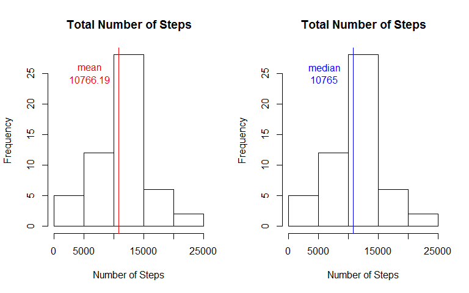
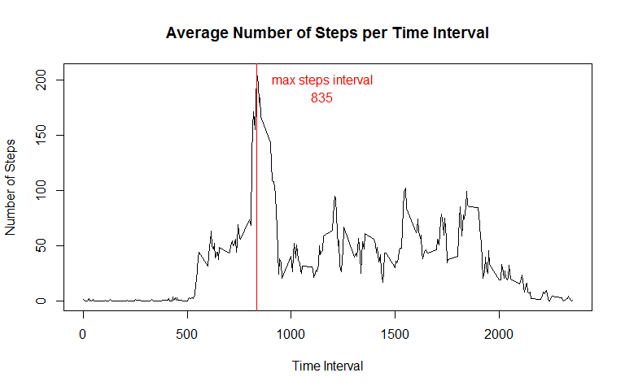
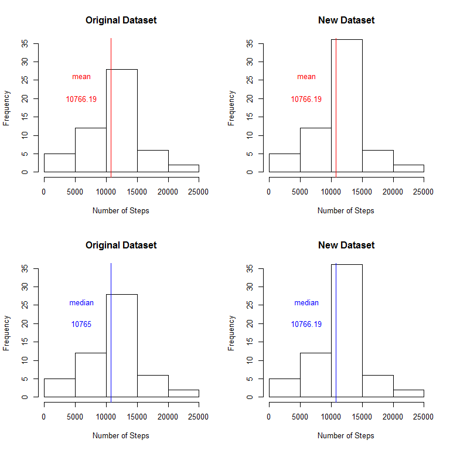
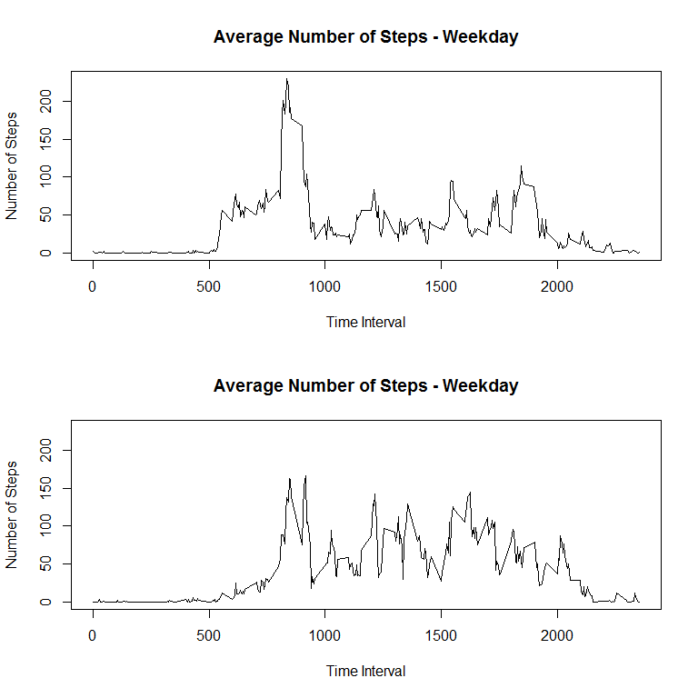

# Reproducible Research: Peer Assessment 1

## Loading and preprocessing the data
Setting working directory.

```r
wd <- "C:/Users/Svetlana/Dropbox/rWorkingDirectory/5_Reproducible_Research/RepData_PeerAssessment1"
setwd(wd)
```

Downloading file, unzipping and opening it with ```read.csv```. Cleaning environment from unnesessary variables.

```r
link <- "http://d396qusza40orc.cloudfront.net/repdata%2Fdata%2Factivity.zip"
temp <- tempfile()
download.file(link, temp)
data <- read.csv(unz(temp, "activity.csv"))
unlink(temp)

rm(wd)
rm(link)
rm(temp)
```

## What is mean total number of steps taken per day?

Subsetting original data, getting rid of missing factor values.

```r
q1_data <- data[!is.na(data$steps), 1:2]
q1_data$date <- factor(q1_data$date)
```

#### Calculating total number of steps

Splitting by ```date``` column, calculating means, creating data frame. Cleaning environment.

```r
s <- split(q1_data, q1_data$date)
q1_total <- lapply(s, function(x) sum(x[, "steps"]))
q1_matrix <- data.frame(date = names(q1_total),
                        total_steps = unname(unlist(q1_total)))
row.names(q1_matrix) <- names(q1_total)

rm(s)
rm(q1_total)
```

#### Calculating mean and median number of steps per day
Mean and median total number of steps taken per day.

```r
mean(q1_matrix$total_steps)
```

```
## [1] 10766.19
```

```r
median(q1_matrix$total_steps)
```

```
## [1] 10765
```

#### Plotting histogram

```r
par(mfrow=c(1,2))
hist(q1_matrix$total_steps,
     main = "Total Number of Steps",
     xlab = "Number of Steps")
abline(v = mean(q1_matrix$total_steps), col = "red", lwd = 1)
text(6000,26, labels = 'mean', col = "red")
text(6000,24, labels = round(mean(q1_matrix$total_steps),2), col = "red")
hist(q1_matrix$total_steps,
     main = "Total Number of Steps",
     xlab = "Number of Steps")
abline(v = median(q1_matrix$total_steps), col = "blue", lwd = 1)
text(6000,26, labels = 'median', col = "blue")
text(6000,24, labels = median(q1_matrix$total_steps), col = "blue")
```

 

## What is the average daily activity pattern?

Subsetting original data, reformatting ```interval``` values.

```r
q2_data <- data[!is.na(data$steps), c(1,3)]
q2_data$interval <- factor(unlist(q2_data$interval))
```
Splitting by ```interval``` column, calculating means, creating data frame. Cleaning environment.

```r
s <- split(q2_data, q2_data$interval)
q2_mean <- lapply(s, function(x) mean(x[, "steps"]))
q2_matrix <- data.frame(time_interval = names(q2_mean),
                        mean_steps = unname(unlist(q2_mean)))
row.names(q2_matrix) <- names(q2_mean)

rm(s)
rm(q2_mean)
```

#### Time interval with maximum average number of steps


```r
q2_matrix[q2_matrix$mean_steps == max(q2_matrix$mean_steps),]
```

```
##     time_interval mean_steps
## 835           835   206.1698
```

#### Plotting


```r
par(mfrow=c(1,1))
plot(row.names(q2_matrix),
     q2_matrix$mean_steps,
     type = 'l',
     main = "Average Number of Steps per Time Interval",
     xlab = "Time Interval",
     ylab = "Number of Steps")
q2_max_x <- as.numeric(
              as.character(
                q2_matrix[q2_matrix$mean_steps == max(q2_matrix$mean_steps),]$time_interval))
abline(v = q2_max_x,
       col = "red",
       lwd = 1)
text(1150,200, labels = 'max steps interval', col = "red")
text(1150,185, labels = q2_max_x, col = "red")
```

 

```r
rm(q2_max_x)
```


## Imputing missing values
#### Total number of missing values in the dataset 
The only missing values in the dataset are in the ```steps``` column.

```r
c(sum(is.na(data$steps)), sum(is.na(data$date)), sum(is.na(data$interval)))
```

```
## [1] 2304    0    0
```

#### Imputing strategy
Since sometimes we have values from whole day missing it would be best to choose **mean for 5-minute interval** as the 
strategy for filling in all of the missing values in the dataset.

#### Constructing new dataset

Mean values for 5-minute interval are extracted from ```q2_matrix``` which was constructed previously.

```r
q3_data <- data
for (i in 1:dim(q3_data)[1]){
  if (is.na(q3_data[i,]$steps)){
    q3_data[i,]$steps <- q2_matrix[q2_matrix$time_interval == q3_data[i,]$interval,]$mean_steps
  }
}

rm(i)
```
#### Total number of steps taken each day - new dataset

To calculate total number of steps splitting by ```date``` column, calculating means, creating data frame. Cleaning 
environment.

```r
q3_data$date <- factor(q3_data$date)
s <- split(q3_data, q3_data$date)
q3_total <- lapply(s, function(x) sum(x[, "steps"]))
q3_matrix <- data.frame(date = names(q3_total),
                        total_steps = unname(unlist(q3_total)))
row.names(q3_matrix) <- names(q3_total)

rm(s)
rm(q3_total)
```

#### Mean and median total number of steps taken per day.

```r
mean(q3_matrix$total_steps)
```

```
## [1] 10766.19
```

```r
median(q3_matrix$total_steps)
```

```
## [1] 10766.19
```

#### Plotting histogram

```r
par(mfrow=c(2,2))

hist(q1_matrix$total_steps,
     main = "Original Dataset",
     xlab = "Number of Steps",
     ylim = c(0, 35))
abline(v = mean(q1_matrix$total_steps), col = "red", lwd = 1)
text(6000,26, labels = 'mean', col = "red")
text(6000,20, labels = round(mean(q1_matrix$total_steps),2), col = "red")

hist(q3_matrix$total_steps,
     main = "New Dataset",
     xlab = "Number of Steps",
     ylim = c(0, 35))
abline(v = mean(q3_matrix$total_steps), col = "red", lwd = 1)
text(6000,26, labels = 'mean', col = "red")
text(6000,20, labels = round(mean(q3_matrix$total_steps),2), col = "red")

hist(q1_matrix$total_steps,
     main = "Original Dataset",
     xlab = "Number of Steps",
     ylim = c(0, 35))
abline(v = median(q1_matrix$total_steps), col = "blue", lwd = 1)
text(6000,26, labels = 'median', col = "blue")
text(6000,20, labels = median(q1_matrix$total_steps), col = "blue")

hist(q3_matrix$total_steps,
     main = "New Dataset",
     xlab = "Number of Steps",
     ylim = c(0, 35))
abline(v = median(q3_matrix$total_steps), col = "blue", lwd = 1)
text(6000,26, labels = 'median', col = "blue")
text(6000,20, labels = round(median(q3_matrix$total_steps),2), col = "blue")
```

 

## Are there differences in activity patterns between weekdays and weekends?

Setting English locale to have names of weekdays in English

```r
Sys.setlocale("LC_TIME", "English")
```

```
## [1] "English_United States.1252"
```

#### Creating new factor variable

Calculating the new ```weekday``` variable. Setting "Saturday" and "Sunday" dates to "weekend".

```r
q4_data <- q3_data
q4_data$date <- as.Date(q4_data$date)
q4_data$weekday <- "weekday"
q4_data[(weekdays(q4_data$date) == "Saturday")|(weekdays(q4_data$date) == "Sunday") ,]$weekday <- "weekend"
```

Subsetting original data, reformatting ```interval``` values.

```r
q4_data_weekday <- q4_data[q4_data$weekday == "weekday", c(1,3)]
q4_data_weekend <- q4_data[q4_data$weekday == "weekend", c(1,3)]
q4_data_weekday$interval <- factor(unlist(q4_data_weekday$interval))
q4_data_weekend$interval <- factor(unlist(q4_data_weekend$interval))
```

Splitting by ```interval``` column, calculating means, creating data frame. Cleaning environment.

```r
s <- split(q4_data_weekday, q4_data_weekday$interval)
q4_data_weekday_mean <- lapply(s, function(x) mean(x[, "steps"]))
q4_data_weekday_matrix <- data.frame(time_interval = names(q4_data_weekday_mean),
                        mean_steps = unname(unlist(q4_data_weekday_mean)))
row.names(q4_data_weekday_matrix) <- names(q4_data_weekday_mean)

s <- split(q4_data_weekend, q4_data_weekend$interval)
q4_data_weekend_mean <- lapply(s, function(x) mean(x[, "steps"]))
q4_data_weekend_matrix <- data.frame(time_interval = names(q4_data_weekend_mean),
                        mean_steps = unname(unlist(q4_data_weekend_mean)))
row.names(q4_data_weekend_matrix) <- names(q4_data_weekend_mean)

rm(s)
rm(q4_data_weekday)
rm(q4_data_weekend)
rm(q4_data_weekday_mean)
rm(q4_data_weekend_mean)
```

#### Plotting

```r
par(mfrow=c(2,1))
plot(row.names(q4_data_weekday_matrix),
     q4_data_weekday_matrix$mean_steps,
     type = 'l',
     main = "Average Number of Steps - Weekday",
     xlab = "Time Interval",
     ylab = "Number of Steps",
     ylim = c(0, 230)
     )

plot(row.names(q4_data_weekend_matrix),
     q4_data_weekend_matrix$mean_steps,
     type = 'l',
     main = "Average Number of Steps - Weekday",
     xlab = "Time Interval",
     ylab = "Number of Steps",
     ylim = c(0, 230))
```

 
